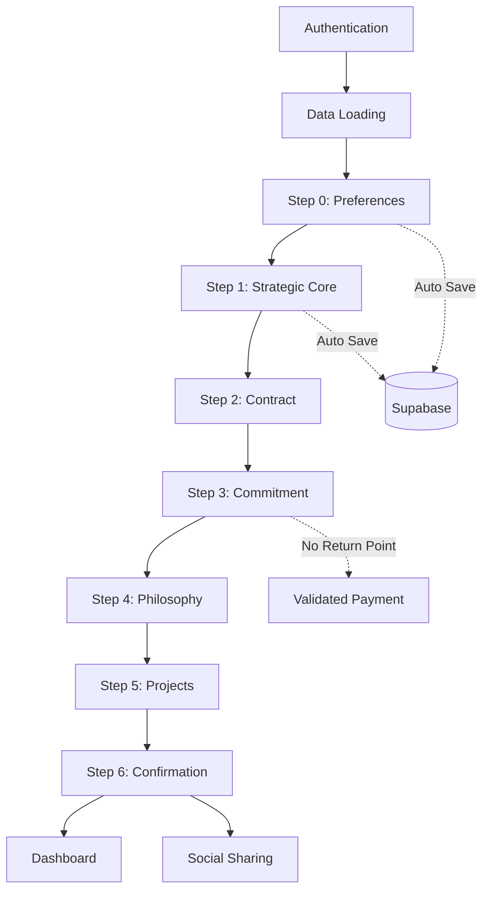

# User Experience – Demand Journey

## Overview

The “Demand” journey is the primary process enabling users to create a collective housing request on the Habitat du Roi platform. This journey guides the user through 7 structured steps, from defining their housing preferences to confirming their commitment.

## Journey Architecture

### Entry Point
- **Route**: `/demande`
- **Authentication**: Required (automatic redirection to `/` if not authenticated)
- **Main Component**: `Demande.tsx`

### Step Management
- **Orchestrator Component**: `DemandStepRenderer.tsx`
- **Persistence**: Automatic saving at each step
- **Navigation**: Visual stepper + Next/Previous buttons

## Step-by-Step Breakdown

### Step 0: Housing Preferences (`EnhancedPreferencesScreen`)
**Goal**: Collect technical and financial criteria for the desired property  
**Collected Data**:
- **Property Type**: Detached House, Apartment, Third Place, Other
- **Property Condition**: New, Old, Renovated, To renovate
- **Standing**: Budget, Standard, Upscale, Luxury
- **Residence Type**: Primary, Secondary, Rental Investment
- **Total Budget**:  
  - France: Euros (default €250k)  
  - U.S.: Dollars (default $550k)
- **Desired Surface Area**:  
  - France: m²  
  - U.S.: sq ft (auto-converted)
- **Location**: Mapbox selection with search radius  
**Validation**: All fields are required

### Step 1: Strategic Core (`StrategicCoreScreen`)
**Goal**: Explore deep aspirations and psychographic profile  
**Collected Data**:
- **Living Situation**: Single, Couple, Family, Retired
- **Demographics**: Age range, household composition
- **Work Status**: Employee, Freelancer, Entrepreneur, Student, Retired, Other
- **Investment Experience**: None, Beginner, Intermediate, Experienced, Expert
- **Blockchain Knowledge**: None to Expert
- **Main Motivation**:
  - Primary residence
  - Rental investment
  - Secondary residence
  - Participatory housing
  - Ecological approach
- **Collaboration Preference**:
  - Pioneer (launch a new project)
  - Participant (join an existing one)
  - Observer (learn first)
- **Dream Description**: Open text field for ideal life project  
**Philosophy**: "We will uncover the full potential of your aspirations to give weight to your project."

### Step 2: Contract Validation (`ContractReader`)
**Goal**: Display and validate the personalized contract  
**Displayed Content**:
- Full recap of user data
- DAO contribution amount (1/1000 of budget)
- Contact info and location preferences
- Terms and conditions  
**Actions**: Validate or go back to modify data

### Step 3: Financial Commitment (`EngagementScreen`)
**Goal**: Finalize financial engagement and tokenization  
**Key Elements**:
- **DAO Contribution**: Auto-calculated (total budget ÷ 1000)
- **Oracle Verification**: Investment data validation button
- **HDR Tokens**:
  - Euro/Dollar to HDR conversion
  - Rate display and trends
  - Future withdrawal option
- **Guarantee Section**: Fund security explanations
- **Payment Simulation**: Financial validation process  
**Point of No Return**: After validation, previous steps become inaccessible

### Step 4: Philosophy (`PhilosophyScreen`)
**Goal**: Present the values of responsible Web3  
**Key Message**: "This Web3 is no trend. It stands on the strength of its principles: sovereignty, transparency, collective commitment."  
**Institutional Guarantee**: Backed by institutional partners for reliability

### Step 5: Existing Projects (`MatchingProjectsScreen`)
**Goal**: Guide users to concrete action  
**Features**:
- **Matching Algorithm**: Displays compatible projects
- **Visualization**: Interactive map + detailed table
- **Two Strategic Options**:
  1. **Create a new DAO** → Become a project pioneer
  2. **Join an existing project** → Join a community  
**Geographic Adaptation**: French or U.S. projects based on region

### Step 6: Confirmation (`ConfirmationScreen`)
**Goal**: Final confirmation and badge delivery  
**Elements**:
- **Visual Recap**: Map with engagement location
- **Pioneer Badge**: Automatically issued
- **Final Options**:
  - Share on social media
  - Finalize and access dashboard
  - Return (last chance)

## Cross-functional Features

### Saving and Persistence
- **Tech**: Supabase with country-specific tables
- **Frequency**: Auto-save on each change
- **Tables Used**:
  - `property_demands_fr` (France)
  - `property_demands_us` (U.S.)
  - `profiles` (shared user data)

### Internationalization
- **Supported Regions**: France, U.S.
- **Adaptations**:
  - Currencies: Euro (€) / Dollar ($)
  - Units: m² / sq ft
  - Geography: French departments / U.S. states
  - Language: French / English

### Navigation & UX
- **Visual Stepper**: 7-step progression with indicators
- **Progressive Validation**: Prevents next steps if data is incomplete
- **Responsive Design**: Mobile/desktop compatibility
- **Animations**: Smooth screen transitions

### Technical Integrations
- **Mapbox**: Geolocation and area selection
- **Captcha**: Secures forms
- **Blockchain**: Solana integration for optional authentication
- **Oracle**: Future investment capacity verification

## Data Flow

## Final Redirections

- **Full Success**: `/success`
- **DAO Creation**: `/dashboard`
- **Existing Project**: `/dashboard`
- **Abandonment**: Data saved for future continuation

## Metrics & Optimizations

### Recommended Metrics
- Step conversion rates
- Time spent per screen
- Drop-offs (typically steps 1 & 3)
- Step 3 return navigation frequency

### UX Optimizations Identified
- Step 1 (Strategic Core): May feel too intrusive
- Step 3 (Commitment): Critical step needing max clarity
- Navigation: Improve preview of upcoming steps

---

*Generated June 2, 2025 – Version 1.0*  
*Project: Habitat du Roi – Web3 Collective Housing Platform*