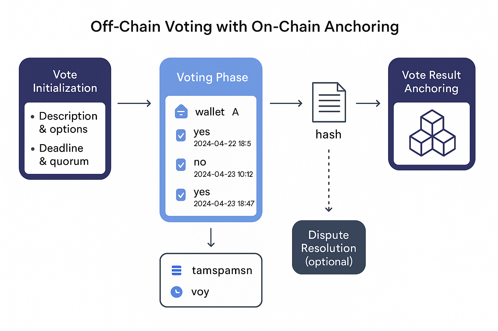

# Voting Model & Governance Process

In the Habitat du Roi® ecosystem, voting is a core component of how decisions are made collectively—whether to validate project feasibility, allocate a fund, choose between alternatives, or approve strategic changes.

To balance flexibility and transparency, we adopt a **hybrid voting model**:  
- Votes are collected off-chain via a secure user interface.  
- Each vote is tied to a wallet and timestamped.  
- The result (or full voting dataset) is hashed (SHA-256).  
- This hash is **anchored on-chain** (e.g., Algorand, Solana) for traceability and verification.

This model avoids the cost and rigidity of full on-chain voting, while ensuring integrity, auditability, and a smooth user experience.

---

## Governance Flow: Off-Chain Voting with On-Chain Anchoring

The diagram below shows the four key steps of this voting mechanism:

*Figure: Hybrid voting flow used in Habitat du Roi® for project governance.*

---

## Phases Explained

### 1. Vote Initialization
A vote is initialized with:
- A description of the issue at stake
- The available options (Yes/No, multiple choice)
- A voting deadline
- A minimum quorum requirement

Each vote is tied to a project or context (e.g., a project `txnId`).

### 2. Voting Phase (Off-Chain)
Eligible users (typically wallets that have contributed to a feasibility fund or hold HDR tokens) cast their votes through the platform. Each submission includes:
- Voter's wallet address
- Vote selection
- Timestamp

Votes are stored securely off-chain.

### 3. Vote Result Anchoring
At the end of the voting phase:
- The votes are aggregated or exported
- A **cryptographic hash** of the data is generated
- This hash is written to the blockchain in a transaction as proof of record

This guarantees that the outcome can be verified at any time by recomputing the hash.

### 4. Optional: Dispute Resolution
If the result is challenged, the full vote record can be rehashed and compared to the on-chain hash. This ensures transparency while keeping the system lightweight.

---

## Future DAO Integration

As the system matures, on-chain DAO-based voting contracts (e.g., via Realms on Solana or equivalent frameworks) may be implemented for:
- Automating the execution of approved proposals
- Enabling token-weighted or quadratic voting schemes
- Managing complex governance workflows

---

## Dynamic DAO: Evolving with the Maturity of the Collective

Unlike static DAOs focused solely on governance tokens or fixed voting power, the **DAO mechanism behind Habitat du Roi® is designed to evolve dynamically** alongside the progression of a project.

At the beginning, participation typically starts with a **1/1000th symbolic engagement**, used to structure demand and assess collective feasibility. As resolutions are voted and adopted, the DAO unlocks new layers of operational depth and responsibility.

Each new vote paves the way for deeper commitment, increased coordination, and gradual transformation of intention into action.

### Progressive Activation Example:

- **Phase 1 — Demand Structuring**  
  Engagement via tokenized expression of interest (e.g., 1/1000th participation)

- **Phase 2 — Governance of Resolution Proposals**  
  Approval of project objectives and legal/technical frameworks

- **Phase 3 — Real-World Actions Initiated via Vote**  
  - Acquisition of land directly from a landowner  
  - Appointment of a surveyor or legal expert  
  - Dialogue with city planning authorities  
  - Soliciting mortgage offers and collective financing  
  - Choosing between architectural or energy models  
  - Finalizing construction commitments

This structure makes the DAO **adaptive** and **project-centric**, rather than abstract or detached. It serves the community not just as a voting layer, but as an **engine of real-world feasibility and execution**.

> *The more the collective proves its coherence and solvency, the further it can go together.*

---

## Summary

This approach reflects the philosophy of Habitat du Roi®:
- Governance must be **accessible**, **verifiable**, and **anchored in reality**
- The right to vote is directly linked to economic or participatory engagement
- Blockchain ensures integrity; the platform ensures usability

> *We build real estate with real decisions, made by real participants.*
